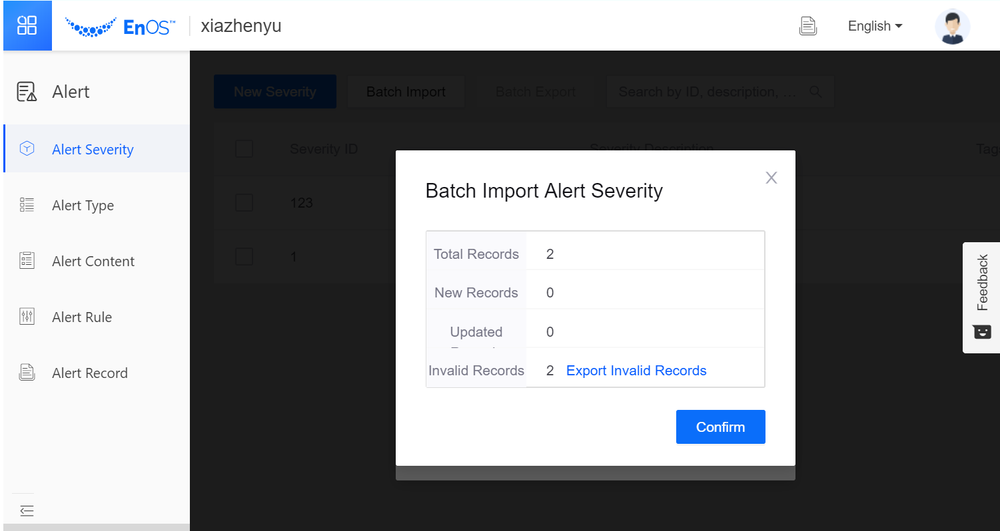

# Managing Alerts in Batch

To improve the configuration efficiency, the alert service supports batch operation. You can export alert configuration as Excel file, edit the Excel file, then import it back to perform batch edit or creation.

Following configurations support batch operations:

- Alert Severity: Import all information in batch, including organization ID, severity ID, description, and tags.
- Alert Type: Import all information in batch, including organization ID, type ID, description, and tags.
- Alert Content: Import all information in batch, including organization ID, content ID, description, tags, model ID, type ID.
- Alert Rule: Import all information in batch, including organization ID, rule ID, description, model ID, measurement point ID, condition, content ID, severity ID, tags, scope, whether to enable, and whether it is a root alert.

## Procedure

This procedure takes the **Alert Severity** as an example to describe how to perform batch edit or creation. The batch operations of other alert configurations are similar to the **Alert Severity**. You can refer to this procedure.

1. Click **Alert > Alert Severity** on EnOS Console navigation menu. 

2. Select one or more alert severity items, and click **Batch Export**. Edit the exported Excel file.

    - To edit multiple alert severity, select all the items you need to edit, and click **Batch Export**.

    - To create multiple new alert severity, select any item and click **Batch Export**. Use the Excel file as a template and add the alert severity information according to the format. Each row represents an alert severity.

    - You can edit and add alert severity at the same time.

3. Save the Excel file when you finished edit. Click **Batch Import** to import the Excel file.

   After choosing the Excel file and clicking **Import**, EnOS will validate the data in the file and prompt the number of successful and failed items. Click **Export Invalid Records** to download the error message and check the failure cause. Fix the issue and import again.

    

4. Click **Confirm** to complete the batch operation.

## Results

- For edited items, the old configuration will be replaced by the new configuration in the Excel file.

- For new added items, new alert severity will be created on EnOS.

